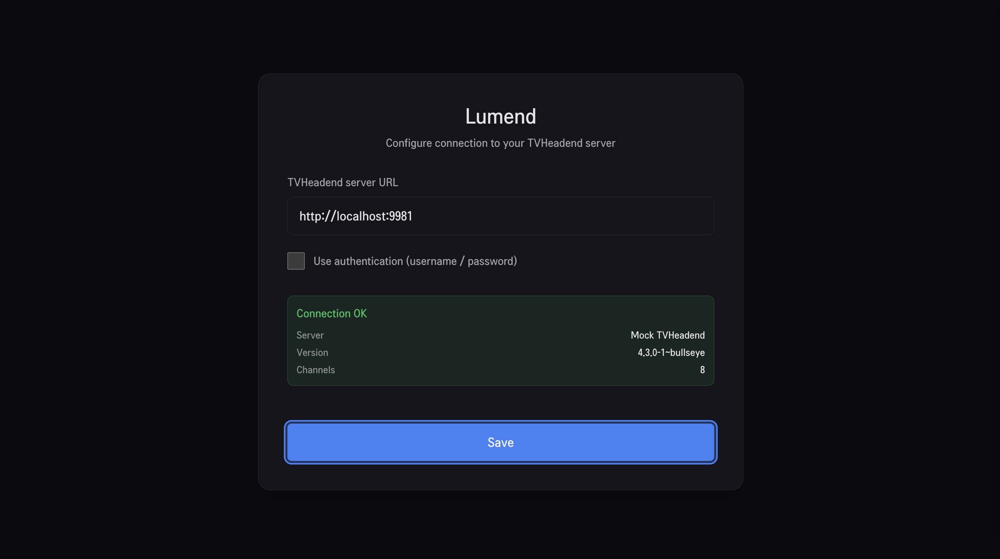
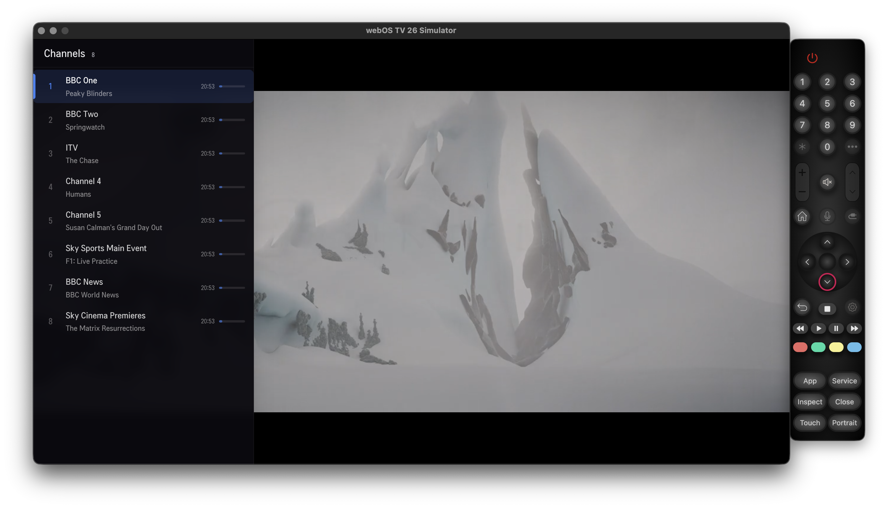
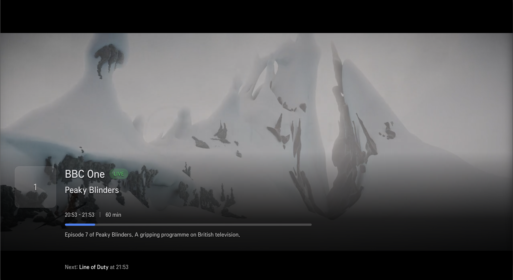
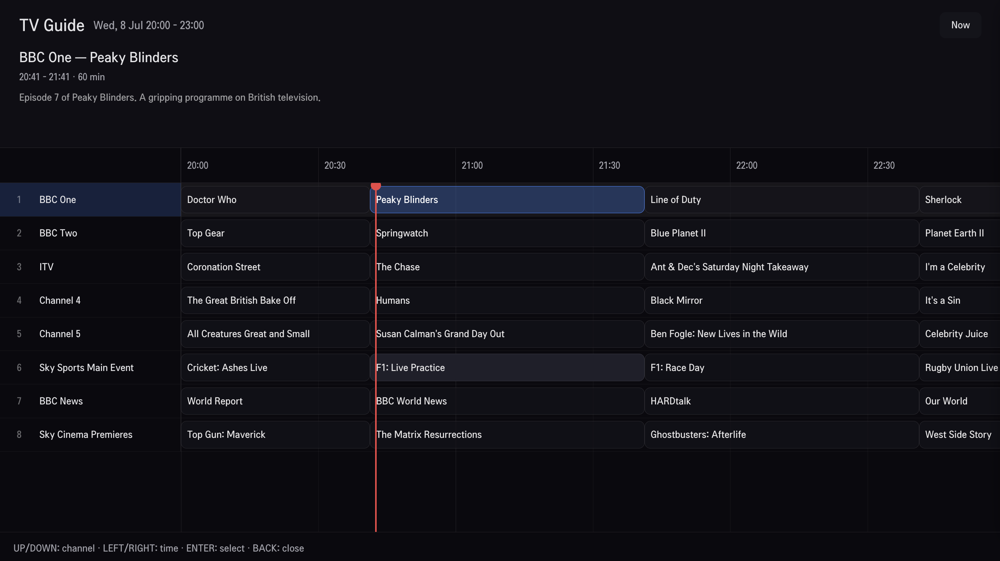

<p align="center">
  
</p>

# Lumend

A modern, lightweight TVHeadend client for LG webOS TVs (2024-2026 models).

Browse live channels, check the programme guide, and stream directly from your
TVHeadend server - all wrapped in a clean, TV-friendly UI optimised for remote
control navigation.

## Features

- One-time setup with connection test
- Channel list with current programme info
- Full-screen EPG grid with time axis and current-time indicator
- HTML5 video player with channel-info overlay
- Remote-first navigation: D-pad, OK, Back, Channel +/-, Page Up/Down
- webOS app packaging and simulator support

## Screenshots

| Setup | Channel List |
|-------|-------------|
|  |  |

| Channel Info | EPG Guide |
|-------------|-----------|
|  |  |

## Tech Stack

- **React 19** + **TypeScript**
- **Vite 8** with `rolldown`
- **Tailwind CSS 4**
- **Zustand** for global state
- **TanStack Query** for data fetching and caching
- **Vitest** / **Playwright** for testing

## Requirements

- Node.js 20+
- A TVHeadend server on your network
- webOS TV CLI 3.2.5+ (used automatically via `npx` in npm scripts)

## Getting Started

```sh
npm install
cp .env.example .env.local
# Edit .env.local and set TVH_URL to your TVHeadend server
```

## Development

```sh
npm run dev
```

App runs at `http://localhost:3000`. Vite's dev proxy forwards `/api`,
`/playlist` and `/stream` requests to the TVHeadend server configured in
`.env.local`, avoiding CORS issues during development.

## Build

```sh
npm run build
```

Output goes to the `build/` directory.

## Test

```sh
npm run test          # unit tests
npm run test:e2e      # end-to-end (requires server configured in .env.local)
```

## Deploy to webOS

### Simulator

```sh
npm run webos:emu
```

### Real TV

```sh
npm run webos:tv
```

Both scripts build, package, install and launch the app in one step.

## Project Structure

```
public/      appinfo.json, icons
service/     webOS JS service proxy (CORS fallback on real TV)
src/
  components/  React components (Player, EPG, ChannelList, Settings)
  hooks/       React Query hooks
  services/    TVHeadend client, storage, webOS adapters
  stores/      Zustand stores
  types/       TypeScript types
build/       webOS build output
```

## How It Works

- **Browser / dev mode**: the app sends requests through Vite's proxy to avoid
  CORS restrictions.
- **Real webOS TV**: the app falls back to the bundled JS service proxy
  (`service/proxy.js`) which uses Node's `http`/`https` modules to forward
  requests to TVHeadend.
- **Streaming**: uses the `pass` profile (original MPEG-TS) from the M3U playlist
  returned by TVHeadend.